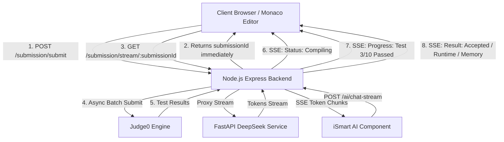

# Server-Sent Events (SSE) in LeetCode Clone

## 1. Overview & Motivation

Server-Sent Events (SSE) is a standardized web technology defined under HTML5 that enables a web server to push real-time, unidirectional text updates to web clients over a single, persistent HTTP connection (`text/event-stream`).

In a competitive programming platform like this project, several operations are long-running and asynchronous:
1. **Code Execution & Verification:** User submits code -> backend compiles -> sends test cases to Judge0 -> polls/waits -> saves result in MongoDB.
2. **AI Doubt Solver (iSmart):** User asks a DSA question -> local DeepSeek model runs LLM token generation -> sends response back.
3. **Live Contests & Leaderboards:** Users solve problems in real-time -> leaderboard ranks shift dynamically.

Currently, the application uses **synchronous HTTP request-response** patterns where requests remain blocked (e.g. `submitToken` polling loop in [backend/utils/judge0Utility.js](file:///c:/Users/Mahesh/OneDrive/Desktop/leetcodepre/backend/utils/judge0Utility.js#L174-L197) for up to 60 seconds). Implementing SSE removes this blocking architecture, eliminates connection timeouts, and delivers instant UI feedback.

---

## 2. Real-Time Technology Comparison

| Feature | Server-Sent Events (SSE) | WebSockets | Short / Long Polling |
| :--- | :--- | :--- | :--- |
| **Communication Flow** | **Unidirectional** (Server $\rightarrow$ Client) | **Bidirectional** (Full Duplex) | **Unidirectional** (Client repeatedly requests) |
| **Protocol** | Standard HTTP / HTTPS | Custom `ws://` / `wss://` protocol | Standard HTTP / HTTPS |
| **Connection Overhead** | **Very Low** (Single long-lived HTTP connection) | **Medium** (TCP connection upgrade + frame parsing) | **High** (New TCP/TLS handshake per poll) |
| **Auto-Reconnection** | **Built-in** by default in browser `EventSource` | Manual implementation needed | Manual implementation needed |
| **Proxy / Firewall Support**| **Native** (Works through all HTTP firewalls & proxies) | May be blocked by restrictive proxies | Native HTTP |
| **Browser Support** | All modern browsers | All modern browsers | Universal |
| **Best Fit for This Project**| **Optimal for:** Code execution progress, AI token streaming, Live notifications | **Overkill** unless real-time collaborative code editor or live 1v1 duels are needed | **Inefficient**; wastes server CPU & database query capacity |

---

## 3. Where We Can Use SSE in This Project



---

### Use Case 1: Asynchronous Code Execution & Submission Results (Primary)

#### Current Limitation:
In [backend/functionForRoute/funForSubmitProblem.js](file:///c:/Users/Mahesh/OneDrive/Desktop/leetcodepre/backend/functionForRoute/funForSubmitProblem.js#L16-L154), when a user clicks **Submit** or **Run**:
- The client sends a `POST` request to `submission/submit/:id`.
- The Express server calls `submitBatch()` and then blocks inside `submitToken()` with a `while` loop for up to 60 seconds polling Judge0.
- If Judge0 takes time (or network latency increases), the client browser or proxy can time out (504 Gateway Timeout).
- The user sees a generic spinning spinner with zero feedback on whether their code is queued, compiling, or running specific test cases.

#### With SSE Implementation:
1. **Instant Response:** User clicks Submit -> Server writes an initial `Submission` document with `status: 'queued'` and immediately responds with `{ submissionId: "..." }` in < 50ms.
2. **Real-time Event Stream:** The client establishes an SSE connection to `/submission/stream/:submissionId`.
3. **Granular Progress Pushes:** Server streams live updates as they occur:
   - `event: status, data: {"status": "QUEUED", "message": "Queued in execution engine..."}`
   - `event: status, data: {"status": "COMPILING", "message": "Compiling C++ code..."}`
   - `event: progress, data: {"status": "RUNNING", "current": 4, "total": 15, "passed": 4}`
   - `event: result, data: {"status": "ACCEPTED", "runtime": 12, "memory": 1024, "passedTestCases": 15, "totalTestCases": 15}`
4. **Immediate Early Exit on Failure:** If testcase #3 gives `Wrong Answer` or `Time Limit Exceeded`, the SSE stream immediately delivers the failed test case details without making the user wait for all remaining test cases.

---

### Use Case 2: AI Doubt Solver (`iSmart`) Token Streaming

#### Current Limitation:
In [frontend/src/components/iSmart.jsx](file:///c:/Users/Mahesh/OneDrive/Desktop/leetcodepre/frontend/src/components/iSmart.jsx#L51) and [backend/functionForRoute/funForAI.js](file:///c:/Users/Mahesh/OneDrive/Desktop/leetcodepre/backend/functionForRoute/funForAI.js#L10-L16), when the user asks a doubt:
- The request waits for the entire LLM response (DeepSeek-Coder 1.3B) to be generated on Python/FastAPI backend (10–40 seconds).
- The user is stuck waiting on an empty chat bubble.

#### With SSE Implementation:
- The Python FastAPI backend yields generated tokens iteratively using `StreamingResponse(..., media_type="text/event-stream")`.
- Express pipes this stream directly to the React frontend.
- `iSmart.jsx` renders each token in real-time (ChatGPT-like typewriter experience), drastically improving perceived latency.

---

### Use Case 3: Live Contest Dynamic Leaderboards

- During live coding contests, scores and problem completion statuses change rapidly.
- Rather than thousands of users polling `/contest/leaderboard` every 5 seconds (which degrades database performance), the backend broadcasts leaderboard delta updates over an SSE channel (`/contest/:contestId/leaderboard-stream`) whenever an accepted submission occurs.

---

### Use Case 4: Real-Time User Notifications & Friend Activity

- Instant notifications when a friend accepts a duel, completes a challenge, or solves a problem from their profile.
- Unlocks achievement badges or streaks live without requiring page reloads.

---

### Use Case 5: System Health & Execution Queue Monitoring

- Real-time status indicator on the UI showing Judge0 API cluster load (e.g. "Judge queue: Normal (0.2s delay)" or "Judge queue busy (3s delay)").

---

## 4. Implementation Blueprint for This Codebase

### A. Backend: SSE Helper Utility

Create a dedicated SSE manager or event emitter to handle multiple client subscriptions:

```javascript
// backend/utils/sseManager.js
const EventEmitter = require('events');
class SSEManager extends EventEmitter {}
const sseEmitter = new SSEManager();

/**
 * Format and write an SSE message
 * @param {Response} res Express response object
 * @param {string} event Event name
 * @param {object|string} data Payload
 * @param {string|number} [id] Optional event ID
 */
const sendSSE = (res, event, data, id = null) => {
    if (id !== null) {
        res.write(`id: ${id}\n`);
    }
    if (event) {
        res.write(`event: ${event}\n`);
    }
    res.write(`data: ${JSON.stringify(data)}\n\n`);
};

module.exports = { sseEmitter, sendSSE };
```

---

### B. Backend: Submission Streaming Route

Update [backend/routes/submit.js](file:///c:/Users/Mahesh/OneDrive/Desktop/leetcodepre/backend/routes/submit.js):

```javascript
// backend/routes/submit.js
const express = require('express');
const submitRouter = express.Router();
const userMiddleware = require('../middleware/userMiddleware');
const { submitCode, runCode, streamSubmissionEvents } = require('../functionForRoute/funForSubmitProblem');

submitRouter.post("/submit/:id", userMiddleware, submitCode);
submitRouter.post("/run/:id", userMiddleware, runCode);

// SSE Stream endpoint
submitRouter.get("/stream/:submissionId", userMiddleware, streamSubmissionEvents);

module.exports = submitRouter;
```

---

### C. Backend: Handler Implementation in `funForSubmitProblem.js`

Update [backend/functionForRoute/funForSubmitProblem.js](file:///c:/Users/Mahesh/OneDrive/Desktop/leetcodepre/backend/functionForRoute/funForSubmitProblem.js):

```javascript
const { sseEmitter, sendSSE } = require('../utils/sseManager');

// 1. Endpoint to initiate SSE connection
const streamSubmissionEvents = async (req, res) => {
    const { submissionId } = req.params;

    // Set standard SSE headers
    res.setHeader('Content-Type', 'text/event-stream');
    res.setHeader('Cache-Control', 'no-cache');
    res.setHeader('Connection', 'keep-alive');
    res.setHeader('X-Accel-Buffering', 'no'); // Disable Nginx proxy buffering
    res.flushHeaders();

    // Send initial connection acknowledgement
    sendSSE(res, 'connected', { message: 'SSE stream established', submissionId });

    // Listener for submission events
    const eventHandler = (payload) => {
        if (payload.submissionId === submissionId) {
            sendSSE(res, payload.event, payload.data);
            
            // Close stream on final terminal events
            if (payload.event === 'completed' || payload.event === 'error') {
                res.end();
            }
        }
    };

    sseEmitter.on('submission_update', eventHandler);

    // Heartbeat ping every 15s to keep connection alive across proxies
    const heartbeat = setInterval(() => {
        res.write(': keep-alive\n\n');
    }, 15000);

    // Clean up when client disconnects
    req.on('close', () => {
        clearInterval(heartbeat);
        sseEmitter.removeListener('submission_update', eventHandler);
    });
};

// 2. Updated asynchronous submitCode function
const submitCode = async (req, res) => {
    try {
        const userId = req.result._id;
        const problemId = req.params.id;
        let { code, language } = req.body;

        if (!userId || !code || !problemId || !language) {
            return res.status(400).json({ error: "Required fields missing" });
        }

        const problem = await Problem.findById(problemId);
        if (!problem) {
            return res.status(404).json({ error: "Problem not found" });
        }

        // Create submission record with 'pending' status
        const submittedResult = await Submission.create({
            userId,
            problemId,
            code,
            language,
            status: 'pending',
            testCasesTotal: problem.hiddenTestCases.length
        });

        // Respond immediately with the submission ID!
        res.status(202).json({
            success: true,
            submissionId: submittedResult._id,
            message: "Submission accepted for processing"
        });

        // Trigger background processing asynchronously
        processSubmissionAsync(submittedResult._id, problem, code, language, userId, problemId);

    } catch (err) {
        console.error("Error in submitCode:", err);
        return res.status(500).json({ error: "Internal Server Error", details: err.message });
    }
};

// 3. Background processor emitting SSE events
async function processSubmissionAsync(submissionId, problem, code, language, userId, problemId) {
    const subIdStr = submissionId.toString();
    try {
        sseEmitter.emit('submission_update', {
            submissionId: subIdStr,
            event: 'status',
            data: { status: 'QUEUED', message: 'Submitting to execution cluster...' }
        });

        const languageId = getLanguageById(language === 'cpp' ? 'c++' : language);
        const submissions = problem.hiddenTestCases.map(tc => ({
            source_code: code,
            language_id: languageId,
            stdin: tc.input,
            expected_output: tc.output
        }));

        sseEmitter.emit('submission_update', {
            submissionId: subIdStr,
            event: 'status',
            data: { status: 'COMPILING', message: 'Compiling source code...' }
        });

        const submitResult = await submitBatch(submissions);
        const resultTokens = extractSubmissionTokens(submitResult);

        // Fetch tokens with intermediate progress
        const testResult = await submitToken(resultTokens);

        let testCasesPassed = 0;
        let runtime = 0;
        let memory = 0;
        let status = 'accepted';
        let errorMessage = null;

        for (let i = 0; i < testResult.length; i++) {
            const test = testResult[i];
            if (test.status_id === 3) {
                testCasesPassed++;
                runtime += parseFloat(test.time) || 0;
                memory = Math.max(memory, test.memory || 0);
            } else {
                status = test.status_id === 4 ? 'error' : 'wrong';
                errorMessage = test.stderr || test.compile_output || test.message;
            }

            // Emit live progress for testcases
            sseEmitter.emit('submission_update', {
                submissionId: subIdStr,
                event: 'progress',
                data: {
                    current: i + 1,
                    total: testResult.length,
                    passed: testCasesPassed,
                    status: test.status?.description || (test.status_id === 3 ? 'Accepted' : 'Failed')
                }
            });
        }

        // Save final result to MongoDB
        await Submission.findByIdAndUpdate(submissionId, {
            status,
            testCasesPassed,
            errorMessage,
            runtime,
            memory
        });

        if (status === 'accepted') {
            await User.findByIdAndUpdate(userId, { $addToSet: { problemSolved: problemId } });
        }

        // Emit final completed result
        sseEmitter.emit('submission_update', {
            submissionId: subIdStr,
            event: 'completed',
            data: {
                accepted: status === 'accepted',
                status,
                totalTestCases: problem.hiddenTestCases.length,
                passedTestCases: testCasesPassed,
                runtime,
                memory,
                errorMessage: status === 'accepted' ? null : errorMessage,
                testResults: testResult
            }
        });

    } catch (error) {
        console.error(`Async submission processing failed:`, error);
        sseEmitter.emit('submission_update', {
            submissionId: subIdStr,
            event: 'error',
            data: { error: 'Execution failed', details: error.message }
        });
    }
}
```

---

### D. Frontend: Client-Side Integration in React (`IntoProblem.jsx`)

In [frontend/src/components/IntoProblem.jsx](file:///c:/Users/Mahesh/OneDrive/Desktop/leetcodepre/frontend/src/components/IntoProblem.jsx), connect to the SSE endpoint upon receiving `submissionId`:

```jsx
// Example hook or method inside IntoProblem.jsx
const submitProblemWithSSE = async () => {
    try {
        const editorCode = getEditorCode();
        if (!editorCode.trim()) {
            alert('Please write code before submitting');
            return;
        }

        setIsSubmitting(true);
        setExecutionProgress({ status: 'INITIATING', message: 'Sending code...' });

        // 1. Submit code and receive submissionId immediately
        const res = await axiosClient.post(`submission/submit/${id}`, {
            code: editorCode,
            language: lang,
        });

        const { submissionId } = res.data;

        // 2. Open SSE stream
        const eventSource = new EventSource(
            `http://localhost:3000/submission/stream/${submissionId}`,
            { withCredentials: true }
        );

        eventSource.addEventListener('status', (e) => {
            const data = JSON.parse(e.data);
            setExecutionProgress(data);
        });

        eventSource.addEventListener('progress', (e) => {
            const data = JSON.parse(e.data);
            setExecutionProgress({
                status: 'RUNNING',
                message: `Executing test case ${data.current} of ${data.total} (${data.passed} passed)`
            });
        });

        eventSource.addEventListener('completed', (e) => {
            const finalResult = JSON.parse(e.data);
            setExecutionResult(finalResult);
            setResultMode('submit');
            setRight('result');
            setIsSubmitting(false);
            eventSource.close();
        });

        eventSource.addEventListener('error', (e) => {
            console.error('SSE Error:', e);
            eventSource.close();
            setIsSubmitting(false);
        });

    } catch (error) {
        console.error('Submit failed:', error);
        setIsSubmitting(false);
    }
};
```

---

### E. AI Chat Streaming Blueprint (`iSmart.jsx` & FastAPI)

#### 1. FastAPI (`ai_service/inference.py`):
```python
from fastapi.responses import StreamingResponse
import asyncio

async def token_generator(prompt: str):
    # Stream tokens from model.generate with TextIteratorStreamer
    for token in streamer:
        yield f"data: {json.dumps({'token': token})}\n\n"
        await asyncio.sleep(0.01)
    yield "data: [DONE]\n\n"

@app.post("/chat-stream")
async def chat_stream(request: ChatRequest):
    prompt = build_prompt(request)
    return StreamingResponse(token_generator(prompt), media_type="text/event-stream")
```

#### 2. Frontend (`iSmart.jsx`) with `ReadableStream`:
```javascript
const response = await fetch("http://localhost:8000/chat-stream", {
    method: "POST",
    headers: { "Content-Type": "application/json" },
    body: JSON.stringify(requestData)
});

const reader = response.body.getReader();
const decoder = new TextDecoder("utf-8");
let fullText = "";

while (true) {
    const { done, value } = await reader.read();
    if (done) break;

    const chunk = decoder.decode(value);
    const lines = chunk.split("\n\n");

    for (const line of lines) {
        if (line.startsWith("data: ")) {
            const raw = line.replace("data: ", "").trim();
            if (raw === "[DONE]") break;
            const parsed = JSON.parse(raw);
            fullText += parsed.token;
            // Update UI with streaming text
            updateStreamingMessage(fullText);
        }
    }
}
```

---

## 5. Production Considerations & Best Practices

1. **Authentication with SSE:**
   - Standard browser `EventSource` supports cookies via `{ withCredentials: true }`.
   - If using `Authorization: Bearer <token>` headers, use the `fetch-event-source` library (`@microsoft/fetch-event-source`) instead of native `EventSource`.
2. **Reverse Proxy Buffering (Nginx / Cloudflare):**
   - Nginx buffers HTTP responses by default, which delays SSE streaming.
   - Always set `X-Accel-Buffering: no` in Express response headers, or configure Nginx:
     ```nginx
     location /submission/stream/ {
         proxy_pass http://localhost:3000;
         proxy_http_version 1.1;
         proxy_set_header Connection '';
         proxy_buffering off;
         proxy_cache off;
         chunked_transfer_encoding off;
     }
     ```
3. **Heartbeat / Keep-Alive:**
   - Proxies and load balancers terminate idle connections after 30–60 seconds.
   - Send a comment line (`: keep-alive\n\n`) every 15 seconds.
4. **Horizontal Scaling across Multiple Servers:**
   - If deploying multiple Node.js backend instances behind a load balancer, use **Redis Pub/Sub** to publish submission events across all instances so any instance holding the client's SSE connection can forward events.
5. **Connection Limits on HTTP/1.1:**
   - Browsers allow max 6 concurrent connections per domain on HTTP/1.1.
   - Using **HTTP/2** multiplexing eliminates this limit entirely.
6. **Graceful Connection Cleanup:**
   - Always register `req.on('close', ...)` on Express and call `eventSource.close()` on React component unmount (`useEffect` cleanup).

---

## 6. Implementation Checklist

- [ ] Create [backend/utils/sseManager.js](file:///c:/Users/Mahesh/OneDrive/Desktop/leetcodepre/backend/utils/sseManager.js) helper with `EventEmitter` and heartbeat support.
- [ ] Add `GET /submission/stream/:submissionId` route in [backend/routes/submit.js](file:///c:/Users/Mahesh/OneDrive/Desktop/leetcodepre/backend/routes/submit.js).
- [ ] Refactor `submitCode` & `runCode` in [backend/functionForRoute/funForSubmitProblem.js](file:///c:/Users/Mahesh/OneDrive/Desktop/leetcodepre/backend/functionForRoute/funForSubmitProblem.js) to return a 202 Accepted status with `submissionId` and process execution asynchronously.
- [ ] Update [frontend/src/components/IntoProblem.jsx](file:///c:/Users/Mahesh/OneDrive/Desktop/leetcodepre/frontend/src/components/IntoProblem.jsx) with `EventSource` listener, displaying real-time test execution progress chips and animated progress bars.
- [ ] Upgrade [frontend/src/components/iSmart.jsx](file:///c:/Users/Mahesh/OneDrive/Desktop/leetcodepre/frontend/src/components/iSmart.jsx) and AI service for token-by-token streaming.
